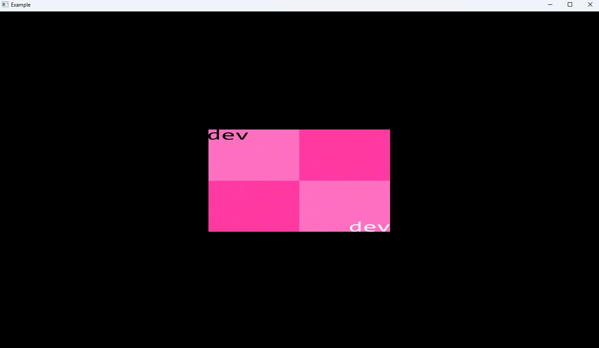

# EVK
This repository represents my attempt to create a header-only implementation of a custom Vulkan renderer.

While compilable libraries is typically more straightforward, it's less than ideal for fast prototyping and code experiments. This project aims to provide a self-contained Vulkan interface that can be easily integrated into any project.

This implementation will exclusively target Vulkan for the foreseeable future, with no immediate plans for abstraction layers or cross-API macros. That being said, the Vulkan code will be contained in certain files only (_vulkan) so if another API gets supported it'll not be a nightmare to implement it.

The focusing will be on Vulkan 1.1, avoiding newer features like dynamic rendering to maintain compatibility with entry-level hardware, so 
for projects requiring advanced Vulkan features, more established frameworks might be more appropriate.

# Build
There's no build, no linking, no references and no dependency outside what's in here. It does rely on some libraries but they're also developed in the same way EVK is and are permissive to be included alongside EVK when given proper credits. The two-step to use the library is the following:

1) This is a "header-only" style API.
Include the "evk" root's subfolder into your project libraries path, don't compile any of the source files as they'll be auto-included when compiling happens.
2) Set ```#define EVK_IMPLEMENTATION``` before ```#include "evk.h"``` in exactly one source file of your project.

There are some pre-configurations that can be requested on your project settings (CMake, Premake, Ninja, etc). They are the following:

* EVK_ENABLE_VALIDATIONS: Requests Vulkan logging feedback to be propagated into the terminal;
* EVK_LINUX_USE_XLIB: If under Linux, hints the use of XLIB instead of XCB/Wayland(default); (UNTESTED)
* EVK_LINUX_USE_XCB: If under Linux, hints the use of XCB instead of XLIB/Wayland(default); (UNTESTED)

Now you're good to and initialize and use the API.

# Example - Emtpy example
This example is just an introduction to the API. For a complete example, check [examples](examples) directory.
```c
void on_render(evkContext* context, float timestep)
{
}

void on_renderui(evkContext* context, void* cmdbuffer)
{
}

int main()
{
    // the first thing is the initial configuration for API startup
    evkCreateInfo info = { 0 };
    info.appName = "My app";
    info.appVersion = EVK_MAKE_VERSION(0, 1, 0, 0);
    info.engineName = "My Engine";
    info.engineVersion = EVK_MAKE_VERSION(0, 0, 1, 0);
    info.width = 1366;
    info.height = 728;
    info.MSAA = evk_Msaa_X4; // use evk_Msaa_Off to disable
    info.vsync = false;
    // a custom viewport can be requested to render the world into
    info.viewport = false; 
    // other platforms will have their own objects for the window
    info.window.window = g_HWND; // WIN32
    
    // now we may initialize the API
    evkResult res = evk_init(&info);

    // we must register callbacks to gain control when to render stuff
    evk_set_render_callback(on_render); // render world objects
    evk_set_renderui_callback(on_renderui); // render ui objects

    // EVK is a renderer, you must handle window and it's event loop, calling:
    // void evk_update(float deltaTime); when appropriate
    // user must resize the evk's framebuffer when a window change size with:
    // void evk_set_framebuffer_size(float2 size);

    // we can't forget to release all resources used
    res = evk_shutdown();

    return 0;
}
```

The result is the following:


# Example - Displaying an image
Following from the previous example, we've defined two functions, one to render world objects and other to render ui objects.  

```c
evkSprite* g_Sprite;

void on_render(evkContext* context, float timestep)
{
    // at this time, it's not easy to render the sprite as it requires a model matrix;
    // this will be changed in the future for simple transformation and all computation will be handled internally
    // for now, considering the main camera spawn, the following will work:

    float3 translation = { 2.0f, 1.0f, 0.0f };  // since main camera spawns at [0, 1, 0]
    float3 rotation = { 270.0f, 0.0f, 0.0f };   // must rotate the sprite X so it faces the camera (currently it culls the backface)
    float3 scale = { 0.5f, 0.5f, 1.0f };        // scale is at your will, z is ignored on sprites

    float3 rot_sprite = { to_fradians(rotation.xyz.x), to_fradians(rotation.xyz.y), to_fradians(rotation.xyz.z) };
    fquat quaternion = fquat_from_euler(&rot_sprite);
    fmat4 rot_matrix = fquat_to_fmat4_rowmajor(&quaternion);

    fmat4 model_matrix = fmat4_identity();
    model_matrix.matrix.m00 = rot_matrix.matrix.m00 * scale.xyz.x;
    model_matrix.matrix.m01 = rot_matrix.matrix.m01 * scale.xyz.x;
    model_matrix.matrix.m02 = rot_matrix.matrix.m02 * scale.xyz.x;

    model_matrix.matrix.m10 = rot_matrix.matrix.m10 * scale.xyz.y;
    model_matrix.matrix.m11 = rot_matrix.matrix.m11 * scale.xyz.y;
    model_matrix.matrix.m12 = rot_matrix.matrix.m12 * scale.xyz.y;

    model_matrix.matrix.m20 = rot_matrix.matrix.m20 * scale.xyz.z;
    model_matrix.matrix.m21 = rot_matrix.matrix.m21 * scale.xyz.z;
    model_matrix.matrix.m22 = rot_matrix.matrix.m22 * scale.xyz.z;

    model_matrix.matrix.m30 = translation.xyz.x;
    model_matrix.matrix.m31 = translation.xyz.y;
    model_matrix.matrix.m32 = translation.xyz.z;

    // render sprite
    evk_sprite_render(g_Example.sprite, &model_matrix);
}

int main()
{
    // we can create sprites right after evk_init(&ci);
    g_Sprite = evk_sprite_create_from_path("assets/texture/error.png", 1);
    
    // ...

    // release the sprite resources after using it (but before evk_shutdown)
    evk_sprite_destroy(g_Sprite);
}
```

The result is the following:


The object's model matrix will be hidden away and proper function for position, rotation, scaling and model matrix calculation will be provided, obfuscating the matrix manipulation just done.

# Notes
The ```tools/shader_dev/_compile.py``` script is a tool that compiles all shaders on that folders into a c array that get's embedded into ```evk/shaders/``` as code. You can generate them yourself if you want, just make sure to have [Vulkan SDK](https://vulkan.lunarg.com/sdk/home) installed.

# Dependencies
Here's the list of dependencies used on this project:
* [vulkan-headers](https://github.com/KhronosGroup/Vulkan-Headers) : Interface that provide the API definitions, types, constants, and function prototypes;
* [volk](https://github.com/zeux/volk) : Dynamically load entrypoints required to use Vulkan without linking;
* [stb_image](https://github.com/nothings/stb/blob/master/stb_image.h) : Load various types of images;
* [memm](https://github.com/franzpedd/memm) : Tracks all allocations made, report all leaks uppon application's request;
* [vecmath](https://github.com/franzpedd/vecmath) : Linear algebra maths library;
* [ctoolbox](https://github.com/franzpedd/ctoolbox) : Utility containers and functions for the c language;
