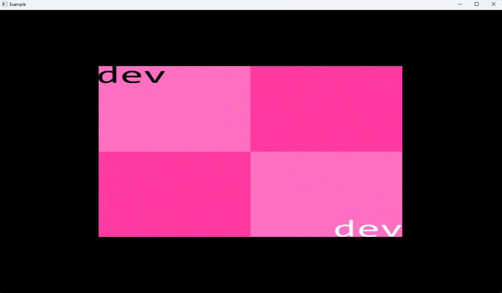
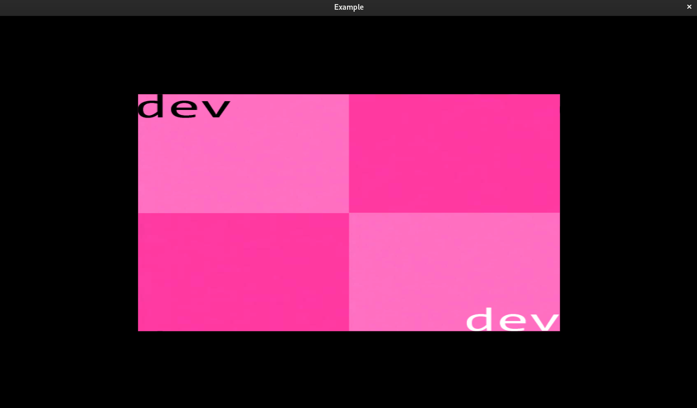

# About

This directory contains example projects demonstrating how to use the API. Each example is self-contained and focuses on a specific aspect of the API.

## Pre-requisites

- C compiler (Clang, GCC, or MSVC);
- EVK library API;
- Platform-specific dependencies:
  - **Windows**: user32.lib;

## Building Examples

### hellosprite_win32.c / hellosprite_x11.c
Demonstrates creating and rendering a static sprite.

**Application result:**
<table align="center">
    <tr>
        <td align="center" width="400">
            
             Windows 
        </td>
        <td align="center" width="400">
            
             Linux (X11) 
        </td>
    </tr>
</table>